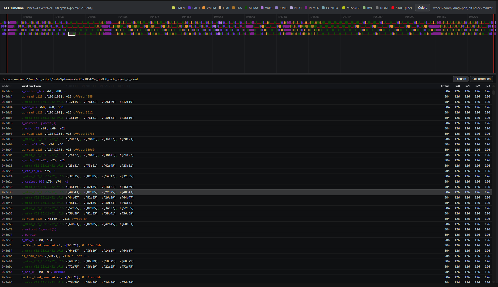

# ATT Trace Viewer (VS Code extension)

Interactive timeline viewer for ROCm Advanced Thread Trace (ATT) inside VS Code, implemented as a Webview.

## Key features

- Interactive timeline (x-axis = cycles), per-wave lanes, hover tooltips
- Instruction category coloring + configurable palette (persisted)
- MFMA vs VALU split coloring
- Disassembly pane with:
  - Clickable register tokens (highlight matching/overlapping registers in nearby lines)
  - `s_waitcnt` dependency hints (polyline arrow to the corresponding memory op)
  - Side-by-side HIP source, when the code object carries DWARF line tables
- Occurrences pane:
  - Lane filter dropdown
  - Δt0 column (delta vs previous occurrence)
- Navigation:
  - Mouse wheel zoom
  - Drag to pan
  - WASD shortcuts (Perfetto-like)
  - Ctrl + left-drag to measure a cycle interval
  - Alt + click to add/remove vertical cycle markers (persisted per trace)

## Screenshot

## Install (Marketplace)

Install from the VS Code Marketplace:

- VS Code UI: Extensions -> search for **ATT Trace Viewer**
- CLI: `code --install-extension jfactory07.att-trace-viewer`

## Install (development)

Open this folder in VS Code and run the extension host:

- VS Code: `Run and Debug` -> `Run Extension`
- CLI: `code --extensionDevelopmentPath=/path/to/vscode-att-viewer`

## Usage

- Command palette: `ATT Viewer: Open ATT Trace`
- Explorer context menu on an `.att` file: `ATT Viewer: Open ATT Trace (from file)`

The extension will:

1. Look for `*_results.db` in the same directory as the `.att` file
2. Use `results.db` tables `rocpd_info_code_object_*` to locate `*_code_object_id_*.out` files
3. Run the bundled `python/att2json.py` to decode the trace to JSON (cached under VS Code `globalStorage`)
4. Open a Webview panel to render the timeline

## Requirements

- ROCm installed, with:
  - `librocprofiler-sdk.so` (thread-trace decoder entry points)
  - `llvm-objdump` at `/opt/rocm/llvm/bin/llvm-objdump`
- Python 3 available (configurable via `attViewer.pythonPath`)
- Trace directory should contain:
  - the `.att` file
  - `*_results.db` (recommended)
  - `*_code_object_id_*.out` (code objects)

If `*_results.db` is missing, the extension falls back to scanning `*_code_object_id_*.out` files.

## Settings

- `attViewer.pythonPath` (default: `python3`)
- `attViewer.gpuArch` (default: `gfx950`)
- `attViewer.maxEvents` (default: 0 = all; for large traces, start with e.g. 200000)

## Keyboard and mouse shortcuts

Timeline:

- Mouse wheel: zoom (cursor-anchored)
- Drag: pan
- WASD: pan/zoom (Perfetto-like)
- Shift + WASD: faster pan/zoom
- Ctrl + left-drag: measure cycle interval (shows Δcycles)
- Alt + click: add/remove a vertical cycle marker
- Hover or click a bar: the instruction on the sub-row under the pointer, when execution windows
  overlap (see [Overlapping execution windows](#overlapping-execution-windows))

Disassembly:

- Ctrl/Cmd + F: search the listing; Enter / Shift + Enter step through matches, Esc clears
- Click a register token (e.g. `v78`, `v[98:101]`, `s61`) to highlight matching registers in nearby lines
- Select `s_waitcnt lgkmcnt(N)` / `vmcnt(N)` to show a polyline arrow to the corresponding previous memory op
- Click or drag rows to select lines, Shift + click to extend, Ctrl/Cmd + A to select all, Esc to clear
- Ctrl/Cmd + C (or the `Copy` button) copies the selected lines as `addr  instruction`
- Right-click the listing for other copy formats (instruction text only, or TSV with per-slot counts)
- Dragging inside a single line still makes a normal text selection, so partial copies work too
- `HIP` opens the source pane; click an instruction to reach its source line, click a source line
  to mark every instruction it compiled to (see [HIP source next to the listing](#hip-source-next-to-the-listing))

## Searching the disassembly

The find box in the panel header (or Ctrl/Cmd + F) searches the loaded code object. It matches
the instruction text and the `addr` column, so `0x6350` jumps to an address just as `v_mfma`
jumps to the first MFMA. Matching substrings are highlighted in place and every matching line
is tinted, which makes it easy to see how a mnemonic is distributed over a loop body.

- The counter shows `current / matching lines`; Enter and Shift + Enter (or the ↑ / ↓ buttons)
  step through them and wrap around
- `Aa` matches case, `.*` switches to a regular expression, e.g. `^v_mfma` or `s_wait_\w*cnt`
- Only instructions the trace actually sampled are searched. The listing is the whole code
  object, so most of it belongs to code the dispatch never entered; `all` widens the search to
  those lines. When a match is hidden this way the counter turns yellow and its tooltip says
  how many were left out
- Stepping leaves the scroll position alone while the match is already on screen, and the
  cursor stays on the nearest match when the query is edited
- Searching never filters rows or changes the selected instruction, so the timeline, the wait
  arrows and the row selection used for copying all stay put

## Reading the rows

ATT only produces per-wave records for one CU/WGP and one SIMD, chosen by `--att-target-cu`
and `--att-simd-select` (on gfx10+ the latter is a SIMD *id*, not a bitmask, so exactly one
SIMD is traced). So each timeline row is a **wave slot** on that one SIMD, labelled `slot N`,
and the header line names the traced scope, e.g. `wgp=1 simd=3 slots=10`. A slot hosts a new
wave whenever the previous one retires, so one row can contain a sequence of waves rather than
a single wave. The other SIMDs contribute VMEM issue events only, without wave attribution.

## Overlapping execution windows

A bar covers an instruction's **execution**, not its issue slot. On gfx10+ the decoder reports
`duration` as `stall + execution time`, `t0 + stall` as the cycle the instruction issued and
`t0 + duration` as the cycle it finished, so a wave that issues one instruction per cycle into a
multi-cycle pipe has several instructions running at once and their windows genuinely overlap.
Four `ds_store_b128` issued at 42249..42252 each run 3 cycles; a `v_wmma_f32_16x16x32_f16` runs
8 cycles while `s_cmp`/`s_cselect`/`s_cbranch` keep issuing behind it.

Overlapping windows are therefore stacked into **sub-rows** inside the slot's row, first fit in
issue order: an instruction takes the topmost sub-row that is free at its issue cycle, so the
row reads top-down in issue order, a stack of *n* bars means *n* instructions in flight, and the
top sub-row is reused as soon as it frees up. A slot whose windows never overlap keeps its
original single-row height; a slot that needs sub-rows splits the same height between them
rather than making the timeline taller. Hovering or clicking picks the instruction on the
sub-row under the pointer, and the tooltip names it as `sub-row=2/3`.

## HIP source next to the listing

The `HIP` button in the panel header opens the source the instructions were compiled from, to the
right of the listing. Both directions are linked:

- Clicking an instruction (in the listing or on the timeline) scrolls the pane to the HIP line it
  came from and marks that line. This works for instructions the traced dispatch never ran too,
  which is most of the listing: reading where an instruction came from does not require a sample
- Clicking a HIP line tints **every** instruction it compiled to and takes the listing to the
  first of them, without disturbing the timeline selection. This is what shows how one line
  becomes a run of instructions: `store_to_lds(...)` on one line of a kernel header is the four
  `ds_store_b128` whose execution windows overlap on the timeline
- Line numbers of lines that produced instructions are marked, and their tooltip says how many;
  lines that compiled to nothing (inlined away, or not part of this template instantiation) stay
  dim and inert
- The dropdown lists every file the code object was compiled from with its instruction count, so
  inlined headers are reachable too. Following an instruction into another file switches the pane
  to it
- Drag the divider to resize the pane; the pane, the file and the selected line are restored when
  the webview reloads

The positions come from the code object's DWARF line table, so the button is only enabled when
the traced code object carries one. Build with `-gline-tables-only` and profile again to get it —
in hipconv that is `-DHIPCONV_LINE_TABLES=ON`, the default. Line tables carry no variable or type
information and **do not change codegen**: compiling `depthwise_solo_shard0` with and without the
flag gives a byte-identical instruction stream, so the timing you are reading is the timing of
the code you would ship. The source files themselves are read from the paths recorded at compile
time; a code object built on another machine reports the file it cannot find in the pane.

## Troubleshooting

- **Decode fails / missing ROCm libs**: ensure ROCm is installed and `/opt/rocm/lib` exists. The extension sets `LD_LIBRARY_PATH=/opt/rocm/lib`.
- **No disassembly**: verify `llvm-objdump` exists at `/opt/rocm/llvm/bin/llvm-objdump` and `attViewer.gpuArch` matches your code object architecture.
- **Large traces are slow**: set `attViewer.maxEvents` to a smaller value for faster iteration.

## Changelog

See [`CHANGELOG.md`](CHANGELOG.md).

